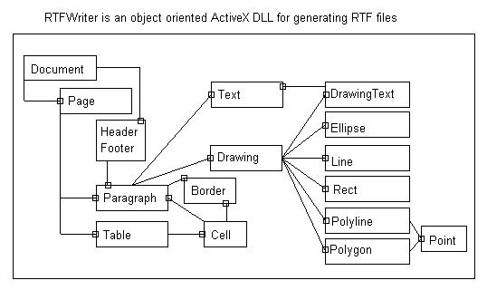



## RTFWriter v\.1\.0

### Description

RTFWriter is an object oriented ActiveX DLL for generating RTF files.

Features:

- Page format: width, height, margins etc.

- Fonts: size, character set, style (bold, italic etc.) and colors

- Paragraph formatting: justification, indentation, border, shading - color, etc.

- Headers - footers

- Tables

- Drawing objects (line, ellipse, rectangle, polygon, polyline and text box)

- Document information
 
### More Info
 

             |
---                |---
**Submitted On**   |2006-03-13 14:17:08
**By**             |[Athanasios Gardos](https://github.com/Planet-Source-Code/PSCIndex/blob/master/ByAuthor/athanasios-gardos.md)
**Level**          |Advanced
**User Rating**    |5.0 (60 globes from 12 users)
**Compatibility**  |VB 6\.0
**Category**       |[OLE/ COM/ DCOM/ Active\-X](https://github.com/Planet-Source-Code/PSCIndex/blob/master/ByCategory/ole-com-dcom-active-x__1-29.md)
**World**          |[Visual Basic](https://github.com/Planet-Source-Code/PSCIndex/blob/master/ByWorld/visual-basic.md)
**Archive File**   |[RTFWriter\_1979993142006\.zip](https://github.com/Planet-Source-Code/athanasios-gardos-rtfwriter-v-1-0__1-64652/archive/master.zip)

